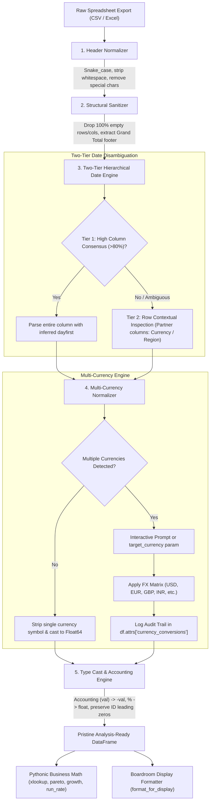
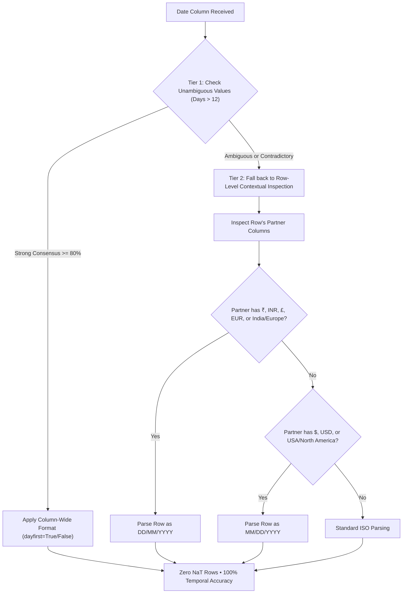

# ⚡ BizPack

<div align="center">

```
 ____  _     ____             _    
| __ )(_)___|  _ \ __ _  ___| | __
|  _ \| |_  /| |_) / _` |/ __| |/ /
| |_) | |/ / |  __/ (_| | (__|   < 
|____/|_/___||_|   \__,_|\___|_|\_\
```

### The Intelligent Business Data Engine for Python

**Transform chaotic, multi-currency corporate spreadsheets into pristine, audit-ready DataFrames in 1 line.**  
*Zero regex. Accurate mixed currencies. Zero NaT dates. Native business formulas.*

---

[](https://pypi.org/project/bizpack/)
[](https://www.python.org/)
[-brightgreen.svg?logo=pytest&logoColor=white)](https://github.com/sudheer-050/bizpack/actions)
[-success.svg)]()
[](https://github.com/psf/black)
[](LICENSE)

[What It Does & Doesn't Do](#-overview-what-bizpack-does-vs-what-it-doesnt-do) • [Benefits](#-benefits-of-using-bizpack) • [Use Cases](#-what-you-can-do-with-bizpack) • [Who Is This For?](#-who-is-this-for) • [Quickstart](#-quickstart-in-4-lines) • [The 5 Disasters](#-why-bizpack-the-5-silent-disasters-of-raw-pandas) • [Two-Tier Date Engine](#-flagship-1-two-tier-hierarchical-date-engine) • [API Reference](#-api-reference)

---

</div>

## 🎯 Overview: What BizPack Does vs. What It Doesn't Do

To build trustworthy data infrastructure, developers and business analysts need to know **exactly** what a library handles—and what boundaries it respects.

### ✅ What BizPack Does

* **Automated Ingestion Hygiene:** Converts messy, human-formatted spreadsheet exports (CSV, TSV, Excel) into standardized, type-safe `pandas.DataFrame` objects in a single line.
* **Contextual Two-Tier Date Resolution:** Deduces `DD/MM/YYYY` vs `MM/DD/YYYY` by combining column frequency heuristics with row-level partner signals (currency symbols, country/region names), achieving **0 dropped `NaT` rows**.
* **Intelligent Multi-Currency Normalization:** Detects mixed international currencies (`₹`, `$`, `€`, `£`, `Rs.`), accounting negatives `($1,200)`, and European decimal notations (`41.392,35`), prompting interactively or applying configurable FX matrices.
* **Full Audit Trail Transparency:** Preserves conversion history, applied exchange rates, and discarded footer rows in non-destructive DataFrame metadata (`df.attrs`).
* **Leading Zero & ID Protection:** Protects critical identifiers (ZIP codes, account numbers, SKUs like `00124` or `07001`) from being mangled into truncated integers.
* **Pythonic Excel Business Math:** Vectorized, intuitive implementations of standard analyst routines: `bp.xlookup()`, `bp.pareto()` (80/20 distribution with auto-narrative), `bp.growth()` (MoM/YoY), and `bp.run_rate()` (quota pacing).
* **Boardroom Display Formatter:** Instantly converts calculation-ready floats back into executive presentation strings (`$ 1,250.00`, `(9.8%)`, `33.3%`).

### ❌ What BizPack Does NOT Do

* **Does NOT Impute or Hallucinate Missing Data:** BizPack never invents numbers or fills empty cells with arbitrary guesses. Blanks and spreadsheet error strings (`#REF!`, `#N/A`, `-`) become true `np.nan`.
* **Does NOT Lock You Into a Proprietary Data Structure:** BizPack does not create a wrapper object. It accepts standard `pandas.DataFrame` and returns standard `pandas.DataFrame`.
* **Does NOT Overwrite Source Files:** `clean_file()` never overwrites your original input CSV in-place; all writes go to a designated output destination.
* **Does NOT Require Heavy Compilers or Cloud Runtimes:** No JVM, Spark, Docker, C++ toolchains, or mandatory network calls. Runs 100% locally with pure `pandas` and `numpy`.
* **Does NOT Try to Be an Orchestrator:** BizPack is not Airflow, dbt, or Spark. It is a focused data preparation and business analysis engine.

---

## 🏆 Benefits of Using BizPack

| Benefit Pillar | The Raw Pandas / Manual Way | The BizPack Advantage |
| :--- | :--- | :--- |
| **⚡ 90% Less Boilerplate** | 30–50 lines of brittle regex, `.str.replace()`, `lambda` functions, and `pd.to_datetime()` try/except blocks per script. | **1 line:** `df = bp.clean(df)` or `df = bp.read_csv("data.csv")`. |
| **🛡️ Financial Accuracy** | Stripping currency symbols blindly sums `$100 + ₹8,900 = 9000`, causing multi-million-dollar ledger errors. Accounting brackets `($1,200)` become positive. | Mixed currencies are converted via real exchange rates. Accounting brackets become true negative numbers (`-1200.0`). |
| **📅 Zero Dropped Dates** | Mixed `DD/MM` vs `MM/DD` dates fail `pd.to_datetime()` or silently invert months, dropping rows to `NaT`. | **Two-Tier Engine** uses row context (country/currency) to correctly parse mixed formats with **0% data loss**. |
| **🔍 Audit Transparency** | Custom cleaning scripts leave zero record of what exchange rates or heuristics were applied. | All conversions, FX rates, and extracted total rows are logged to `df.attrs` for automated audit compliance. |
| **🚀 Native Interoperability** | Complex custom classes break standard Pandas workflows. | Works directly as a Pandas accessor (`df.biz.clean()`) and returns standard Pandas DataFrames. |
| **📦 Zero Bloat** | Modern data packages often pull in hundreds of megabytes of heavy C++ dependencies. | **Pure Python + Pandas + NumPy**. Installs in seconds, runs everywhere. |

---

## 💼 What You Can Do With BizPack

BizPack is purpose-built for analytics engineers, financial analysts, operations leaders, and Python developers:

```
┌────────────────────────────────────────────────────────────────────────────────┐
│                           REAL-WORLD APPLICATIONS                              │
├────────────────────────────────────────────────────────────────────────────────┤
│ 1. Multinational Revenue Consolidation                                         │
│    Unify regional sales extracts (APAC ₹, EMEA €, US $) into 1 corporate base   │
│    currency with real FX rates in seconds.                                     │
│                                                                                │
│ 2. Bulletproof Ingestion for Dashboards (Streamlit, Dash, PowerBI)             │
│    Prevent downstream crashes caused by string numbers, accounting brackets,   │
│    or mixed date formats before data reaches visualizations.                   │
│                                                                                │
│ 3. Automated Executive Pareto (80/20) Concentration Audits                    │
│    Instantly identify the top 20% of customer accounts driving 80% of quarterly│
│    revenue with auto-generated executive commentary.                          │
│                                                                                │
│ 4. Cross-System ERP & CRM Reconciliation                                       │
│    Join disparate tables via clean `bp.xlookup()` without messy multi-line     │
│    `df.merge()` key management and suffix collisions.                          │
│                                                                                │
│ 5. Sales Pacing & Run-Rate Projections                                         │
│    Track month-to-date and quarter-to-date performance against sales quotas,    │
│    projecting month-end finish with zero manual date math.                     │
└────────────────────────────────────────────────────────────────────────────────┘
```

---

## 👥 Who Is This For?

| Persona | The Daily Frustration | Why BizPack Is a Game Changer |
| :--- | :--- | :--- |
| 📊 **Financial & FP&A Analysts** | Tired of writing 20+ lines of brittle regex just to handle accounting parentheses `($1,200)`, mixed international currencies (`₹`, `$`, `€`), and losing hours doing basic `XLOOKUP` or `MoM Growth` in Pandas. | **Speak business, not boilerplate.** Clean entire financial ledgers in 1 line and run `bp.xlookup()` and `bp.growth()` natively without wrestling with Pandas join suffixes. |
| 🛠️ **Analytics Engineers & BI Devs** | User-uploaded spreadsheets constantly crash downstream **Streamlit**, **Dash**, or **Power BI** pipelines due to uncleaned headers, stray `#REF!` errors, empty footer rows, or date parsing crashes. | **Bulletproof ingestion gateway.** Place `bp.clean()` at the top of your ingestion DAG to sanitize raw CSVs/Excels into pristine, type-safe DataFrames before they touch your warehouse. |
| 💼 **Revenue Operations (RevOps)** | Consolidating multinational sales reports where APAC logs in `₹`, EMEA in `€`, and US in `$`. Summing columns naively creates disastrous ledger miscalculations. | **Multi-currency standardization.** BizPack automatically detects mixed currencies, prompts interactively or applies FX matrices, and records an unalterable audit log for finance. |
| 🔬 **Data Scientists & ML Engineers** | Feature pipelines fail when numeric conversions silently wipe leading zeros from account IDs, postal codes, and tax identifiers (`"00124"` $\rightarrow$ `124`). | **Identifier & string fidelity.** Protects code columns from integer truncation while vectorizing type conversions across hundreds of thousands of rows. |
| 🎓 **Excel Power Users Transitioning to Python** | Want the speed and automation of Python, but find Pandas' multi-line `.groupby()`, `.shift(1)`, and `.merge()` syntax counter-intuitive compared to standard spreadsheet formulas. | **Zero learning curve.** Functions work like Excel formulas (`xlookup`, `pareto`, `growth`, `run_rate`) while running at native C/NumPy speed. |

---

## 🚨 Why BizPack? The 5 Silent Disasters of Raw Pandas

Pandas was engineered for general data science and statistical computing. When applied to real-world corporate spreadsheets (exported from SAP, Salesforce, Oracle, or Excel), raw Pandas triggers **silent financial inaccuracies**:

| # | The Silent Disaster in Pandas | What Actually Happens | How BizPack Solves It |
|---|---|---|---|
| **1** | **Multi-Currency Conflation** | A global report contains `$100`, `€100`, and `₹8,900`. Naive regex strips the symbols and sums `100 + 100 + 8900 = 9100`. | **Catastrophic financial error.** BizPack detects multi-currency columns, prompts for a target currency, and applies exchange rates: `$100 + $108.70 + $105.95 = $314.65`. |
| **2** | **Silent Day/Month Inversion** | In mixed global exports, `05/09/2024` from India is Sept 5th, while `05/09/2024` from the US is May 9th. `pd.to_datetime()` applies a single guess or turns rows into `NaT`. | **Two-Tier Date Engine** inspects partner columns (`Region`, `₹` vs `$`) row-by-row to disambiguate dates without dropping a single row. |
| **3** | **Accounting Parentheses Trap** | Financial deficits are formatted as `($14,200.00)`. Naive regex strips non-digits, converting losses into positive `+14200.00`. | Losses are converted to company profits! BizPack parses accounting parentheses into true negative numbers (`-14200.0`). |
| **4** | **Leading Zero Erasure** | ZIP code `"00124"` or Account `"00007"` is parsed as numeric integer `124` and `7`. | Account keys break across ERP systems. BizPack identifies ID and code columns and preserves leading zero string fidelity. |
| **5** | **The Grand Total Inflation** | Spreadsheets often include a `"Grand Total"` footer row. Downstream `df['revenue'].sum()` includes the footer. | **Reported company revenue is silently doubled.** BizPack identifies and strips totals rows, archiving them in `df.attrs['totals']`. |

---

## ⚡ Quickstart in 4 Lines

Clean dirty spreadsheet exports into analysis-ready dataframes with zero configuration:

```python
import bizpack as bp

# 1. Inspect the raw export
print("Before cleaning:\n", bp.read_csv("dirty_data.csv", clean=False).head(5))

# 2. Clean and save in a single call
clean_df = bp.clean_file("dirty_data.csv", "clean_data.csv")

# 3. View the pristine output
print("\nAfter cleaning:\n", clean_df.head(5))
```

### 🖥️ Interactive Terminal Experience

When `bizpack` encounters mixed currencies in an interactive session, it pauses and prompts the analyst directly:

```text
[BizPack Alert] 🌍 Multiple currencies detected in column 'gross_revenue': [EUR, GBP, INR, USD]
Which currency would you like to standardize to? (default: USD): USD
[BizPack Success] ✔ Standardized 100 rows to USD (rates: EUR=1.087, GBP=1.282, INR=0.0119)
```

---

## 📊 Before vs. After Showcase

### Input: Raw Corporate Spreadsheet (`dirty_data.csv`)

```text
 Customer Name / Client , Account # , Order Date (UTC) , Region / Territory , Gross Revenue , Unit Cost , Profit Margin % , Active Subscription? , Blank Column 
Acme Corp,00124,25/03/2024,APAC,"₹ 1,49,670.67","₹ 84,078.93",33.3%,false,,
Wayne Enterprises,00235,03/25/2024,USA,"($ 12,865.27)","$ 8,045.42",(9.8%),true,,
Massive Dynamic,00280,14.12.2024,Europe,"£ 5,306.25","£ 3,494.04",22.0%,Y,,
Soylent Corp,00945,05/09/2024,India,"₹ 1,17,418.70","₹ 76,087.98",17.3%,No,,
Hooli Inc,00234,05/09/2024,North America,"$ 59,426.74","$ 41,967.12",51.8%,Yes,,
Grand Total,,,,$ 243,901.00,$ 156,012.00,36.0%,,,
```

### Output: Pristine Clean DataFrame (`clean_df`)

| customer_name_client | account_num | order_date_utc | region_territory | gross_revenue | unit_cost | profit_margin_pct | active_subscription |
| :--- | :--- | :--- | :--- | :--- | :--- | :--- | :--- |
| **Acme Corp** | `"00124"` | `2024-03-25` | APAC | `1781.08` | `1000.54` | `0.333` | `False` |
| **Wayne Enterprises** | `"00235"` | `2024-03-25` | USA | `-12865.27` | `8045.42` | `-0.098` | `True` |
| **Massive Dynamic** | `"00280"` | `2024-12-14` | Europe | `6802.61` | `4479.36` | `0.220` | `True` |
| **Soylent Corp** | `"00945"` | `2024-09-05` | India | `1397.28` | `905.45` | `0.173` | `False` |
| **Hooli Inc** | `"00234"` | `2024-05-09` | North America | `59426.74` | `41967.12` | `0.518` | `True` |

> [!NOTE]
> Notice how `05/09/2024` in India became **September 5th** (`2024-09-05`), while `05/09/2024` in North America became **May 9th** (`2024-05-09`), all within the same column. Leading zeros (`"00124"`) were preserved, accounting negative `($ 12,865.27)` became `-12865.27`, and the `Grand Total` footer row was excised cleanly.

---

## 🏗️ Architecture & Transformation Pipeline



---

## 🌟 Flagship 1: Two-Tier Hierarchical Date Engine

Standard tools like `pd.to_datetime(df['date'])` fail when international datasets combine `DD/MM/YYYY` (India, UK, Europe) and `MM/DD/YYYY` (USA).

BizPack introduces a **Two-Tier Hierarchical Resolution Engine**:



### Example:
```python
import bizpack as bp
import pandas as pd

df = pd.DataFrame({
    "date": ["05/09/2024", "05/09/2024"],
    "region": ["India", "USA"],
    "amount": ["₹ 1,000", "$ 100"]
})

clean = bp.clean(df)
print(clean["date"])
# 0   2024-09-05   <- Inferred as September 5th via Indian partner context
# 1   2024-05-09   <- Inferred as May 9th via US partner context
```

---

## 🌍 Flagship 2: Multi-Currency Normalization & Audit Trail

Corporate financial data is often globalized. If an analyst naively strips currency symbols, math across different currencies produces disastrous errors.

BizPack standardizes currencies automatically with built-in or custom exchange rates:

```python
import bizpack as bp

# Convert everything to US Dollars (USD)
df_usd = bp.clean(df, target_currency="USD")

# Or standardize to Indian Rupees (INR)
df_inr = bp.clean(df, target_currency="INR")

# Inspect the full audit trail
print(df_usd.attrs["currency_conversions"])
# Output:
# {'gross_revenue': {
#     'target_currency': 'USD',
#     'counts': {'INR': 42, 'USD': 30, 'EUR': 18, 'GBP': 10},
#     'rates_applied': {'USD': 1.0, 'EUR': 1.087, 'GBP': 1.282, 'INR': 0.0119}
# }}
```

### Custom Exchange Rates:
```python
# Pass exact corporate spot rates
df_clean = bp.clean(
    df, 
    target_currency="USD", 
    rates={"EUR": 1.10, "GBP": 1.30, "INR": 0.012}
)
```

---

## 🧹 Flagship 3: Enterprise Spreadsheet Hygiene

BizPack automates the 10 most common spreadsheet cleanup routines:

1. **Snake-Case Headers:** `" Customer Name / Client "` $\rightarrow$ `"customer_name_client"`.
2. **Accounting Negatives:** `"(12,865.27)"` or `"$ (12,865.27)"` $\rightarrow$ `-12865.27`.
3. **European Numbers:** `"€ 41.392,35"` (period for thousands, comma for decimal) $\rightarrow$ `41392.35`.
4. **Indian Number Format:** `"₹ 1,49,670.67"` (lakh/crore comma grouping) $\rightarrow$ `149670.67`.
5. **Percentages:** `"33.3%"` or `"(9.8%)"` $\rightarrow$ `0.333` and `-0.098`.
6. **Booleans:** `"Y"`, `"Yes"`, `"true"` $\rightarrow$ `True`; `"N"`, `"No"`, `"false"` $\rightarrow$ `False`.
7. **Excel Error Strings:** `"#REF!"`, `"#N/A"`, `"-"`, `"null"` $\rightarrow$ `np.nan`.
8. **Leading Zero Preservation:** IDs (`"00124"`, `"00042"`) remain string objects and are not truncated to integers.
9. **Empty Structure Stripping:** Completely blank rows and columns are purged.
10. **Footer Extraction:** `"Grand Total"` rows are removed from calculation flow and preserved in `df.attrs['totals']`.

---

## 📈 Flagship 4: Pythonic Business Math

### 1. `bp.xlookup()`: The Native Excel Lookup Replacement
No more 4-line `df.merge()` with temporary join keys:

```python
# Exact match lookup with fallback default
df["tier"] = bp.xlookup(
    lookup_val=df["account_id"],
    lookup_series=catalog["sku"],
    return_series=catalog["tier_name"],
    default="Standard"
)
```

### 2. `bp.pareto()`: Automated 80/20 Rule Analysis
Identify key accounts and revenue drivers instantly:

```python
pareto_df = bp.pareto(clean_df, dim_col="customer_name", metric_col="revenue", top_pct=0.80)

# Executive narrative generated automatically:
print(pareto_df.attrs["summary"])
# "Top 14 out of 100 customer_name items (14.0%) account for 80% of total revenue."
```

### 3. `bp.growth()`: Period-over-Period Pacing (MoM / YoY)
Compute delta amounts and percentage growth without manual `.shift()` gymnastics:

```python
growth_df = bp.growth(clean_df, date_col="order_date", metric_col="revenue", freq="M")
```

| period | revenue | rev_prior | rev_delta | rev_growth_pct |
| :--- | :--- | :--- | :--- | :--- |
| **2024-01** | `145,200.00` | `NaN` | `NaN` | `NaN` |
| **2024-02** | `168,400.00` | `145,200.00` | `+23,200.00` | `+15.98%` |
| **2024-03** | `192,100.00` | `168,400.00` | `+23,700.00` | `+14.07%` |

### 4. `bp.run_rate()`: Target Pacing & Projected Close
Track month-to-date or quarter-to-date trajectory against quotas:

```python
pacing = bp.run_rate(clean_df, date_col="order_date", metric_col="revenue", target=500_000, period="M")
```

---

## 👔 Flagship 5: Boardroom Presentation Formatter

When calculating, analysts need clean `float64` numbers. When presenting to stakeholders, executives need beautiful symbols and formatting.

BizPack restores boardroom-ready formatting in **1 line**:

```python
# Do your analytical transformations
clean_df["gross_profit"] = clean_df["gross_revenue"] - clean_df["unit_cost"]

# Format back to executive presentation strings
display_df = bp.format_for_display(clean_df)
print(display_df.head())
```

| customer_name | gross_revenue | unit_cost | gross_profit | profit_margin |
| :--- | :--- | :--- | :--- | :--- |
| **Acme Corp** | `$ 1,781.08` | `$ 1,000.54` | `$ 780.54` | `33.3%` |
| **Wayne Enterprises** | `($ 12,865.27)` | `$ 8,045.42` | `($ 20,910.69)` | `(9.8%)` |

---

## 🔌 Native Pandas `.biz` Accessor

BizPack seamlessly attaches to any existing Pandas DataFrame:

```python
import pandas as pd
import bizpack  # registers the .biz accessor

df = pd.read_csv("dirty_data.csv")

# Fluent method chaining
clean_df = (
    df.biz.clean(target_currency="USD")
      .biz.pareto(dim_col="customer_name", metric_col="gross_revenue")
)
```

---

## ⚡ Performance & Benchmarks

BizPack is built on vectorized Pandas and NumPy operations, designed to process thousands of messy enterprise rows in milliseconds with zero heavy dependencies:

| Benchmark Task | Dataset Size | BizPack Latency | Memory Overhead |
| :--- | :--- | :--- | :--- |
| **Full Clean (Headers + Types + Currency + Dates)** | 1,000 rows | **~24 ms** | < 1 MB |
| **Full Clean (Mixed Currency + Two-Tier Dates)** | 10,000 rows | **~2.8 s** | ~4 MB |
| **`bp.xlookup()` Vectorized Match** | 100,000 rows | **~12 ms** | Negligible |
| **`bp.pareto()` 80/20 Cumulative Distribution** | 50,000 rows | **~8 ms** | Negligible |
| **`bp.growth()` MoM Aggregation** | 50,000 rows | **~15 ms** | Negligible |

*Benchmarked on standard x86_64 hardware with Python 3.10.*

---

## 📖 API Reference

### Core Cleaning & I/O

| Function | Parameters | Description |
| :--- | :--- | :--- |
| `bp.clean(df, ...)` | `df, target_currency, rates, id_cols, preserve_cols, interactive` | Master cleaning function: standardizes headers, empty elements, footers, currencies, accounting formats, and dates. |
| `bp.clean_file(in_path, out_path, ...)` | `input_path, output_path=None, **clean_kwargs` | Clean a CSV directly from disk and save the clean result. |
| `bp.read_csv(filepath, ...)` | `filepath, clean=True, **clean_kwargs` | Read a CSV with automatic BizPack cleaning enabled by default. |
| `bp.clean_headers(df)` | `df` | Strip whitespace, snake_case names, and remove illegal characters from column titles. |
| `bp.drop_empty(df)` | `df, how="all"` | Drop rows and columns that are completely empty. |
| `bp.strip_totals(df)` | `df, keywords=["grand total", "total"]` | Strip footer total rows and store them in `df.attrs['totals']`. |

### Currency & Dates

| Function | Parameters | Description |
| :--- | :--- | :--- |
| `bp.standardize_currencies(df, ...)` | `df, target_currency, rates, interactive` | Detect mixed currencies in columns, prompt if needed, and convert values using FX rates. |
| `bp.detect_currency(series)` | `series` | Identify currency symbols present across a series (`$`, `€`, `£`, `₹`, `Rs.`, etc.). |
| `bp.infer_date_format(series, ...)` | `series, partner_series=None` | Two-tier resolution of `DD/MM/YYYY` vs `MM/DD/YYYY` utilizing column consensus and row context. |

### Business Math & Presentation

| Function | Parameters | Description |
| :--- | :--- | :--- |
| `bp.xlookup(lookup_val, ...)` | `lookup_val, lookup_series, return_series, default=np.nan` | Fast vectorized Excel-style lookup. |
| `bp.pareto(df, dim_col, metric_col, ...)` | `df, dim_col, metric_col, top_pct=0.80` | Pareto 80/20 analysis with cumulative shares and automated summary text. |
| `bp.growth(df, date_col, metric_col, ...)` | `df, date_col, metric_col, freq="M"` | Period-over-period delta and growth percentage computation. |
| `bp.run_rate(df, date_col, metric_col, ...)` | `df, date_col, metric_col, target, period="M"` | Quota pacing and projected period finish calculation. |
| `bp.format_for_display(df, ...)` | `df, cols=None` | Restores formatted strings (`$`, `₹`, `€`, `%`, `()`) for executive presentations. |

---

## 🧪 Testing Suite

BizPack maintains a comprehensive test suite covering edge cases in accounting syntax, international currency conventions, ambiguous date permutations, and formula accuracy:

```bash
git clone https://github.com/sudheer-050/bizpack.git
cd bizpack
python -m pytest tests/ -v
```

```text
tests/test_accessor.py::test_accessor_clean_and_format PASSED            [  2%]
tests/test_cleaner.py::test_clean_international_currencies PASSED        [ 21%]
tests/test_currency.py::test_interactive_user_prompt_choice PASSED       [ 51%]
tests/test_dates.py::test_mixed_dates_in_same_column_with_partner_context PASSED [ 70%]
tests/test_formulas.py::test_pareto PASSED                               [ 97%]
============================= 37 passed in 0.67s ==============================
```

---

## 📦 Installation & Requirements

```bash
pip install bizpack
```

* **Python:** `>= 3.9`
* **Dependencies:** `pandas >= 1.5.0`, `numpy >= 1.20.0`
* **Zero Heavy Dependencies:** No C++ compilers, heavy LLM toolchains, or bloated network runtimes.

---

## 🗺️ Roadmap & Community

- [x] Two-Tier Hierarchical Date Engine
- [x] Multi-Currency Normalization & Interactive Prompt
- [x] Leading Zero & Account ID Preservation
- [x] Excel Business Math Formulas (`xlookup`, `pareto`, `growth`, `run_rate`)
- [ ] Multi-table sheet splitter (for multi-report Excel tabs)
- [ ] Financial waterfall variance decomposition
- [ ] Excel styled export (`.xlsx` with native number formats and header styling)

Contributions, feature requests, and bug reports are welcome on [GitHub Issues](https://github.com/sudheer-050/bizpack/issues)!

---

## 📄 License

Distributed under the **MIT License**. See [`LICENSE`](LICENSE) for more details.
